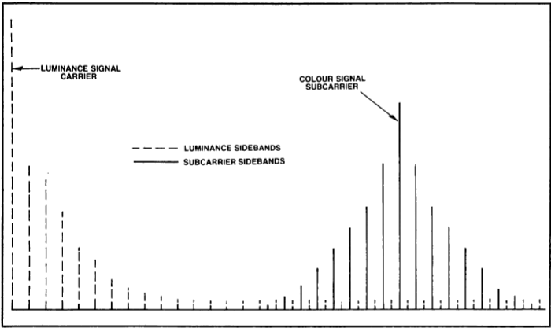
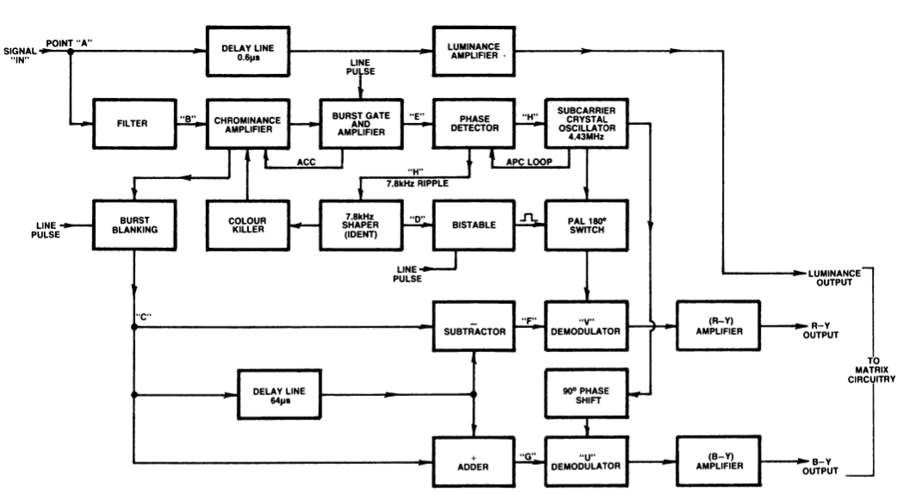
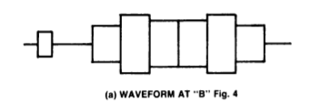
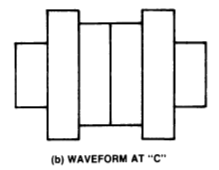

# Notes
## PAL Basics
* 25 fps, with 50 fields being interlaced
* Phase of each field alternates by $180^\circ$
    * technically each line alternates in each phase, but because of interlacing this means each field alternates in phase
* A PAL signal contains 2 minor signals: the chrominance and luminance
    * the luminance is the B/W i.e. the image
    * the chrominance is the colour
* The chrominance consits of two other signals that are modulated onto a 4.43MHz subcarier - the colour burst.
    * these two signals are the B-Y (U) and R-Y (V) signals.

$$
\begin{aligned}
Y &= 0.299R' + 0.587G' + 0.114B' \\
U &= -0.147R' - 0.289G' + 0.436B' = 0.492(B' - Y) \\
V &= 0.615R' - 0.515G' - 0.100B' = 0.877(R' - Y)
\end{aligned}
$$

* In PAL, these components are quadrature modulated, meaning:
    * U modulates the subcarrier in-phase (0°), and
    * V modulates the subcarrier in quadrature (90° phase shift).
* BUT — in PAL, the V component is phase-inverted on every other line - so on alternate lines, the V axis flips, meaning the modulated signal has its phase shifted by 180° in that component.

* Formally, the U and V signals are modulated via surpressed carried quadrature amplitude modulation
    * mathematically just means the U and V siganls are spaced $90^\circ$ apart, in the absence of the carrier signal (however this carrier signal is sent as a colour burst somewhere else - more on this later)
    * i.e. Chrom. = 
$$
\underbrace{a\cos{(2\pi f + \phi_1)}}_U + \underbrace{b\sin{(2\pi f + \phi_2)}}_V
$$
* The phase of the U and V signals determine the colour/hue of the "pixel"

## Colour burst 
* For a TV to decode the transmitted colour signal, the colour subcarrier must be reinserted i.e. through a local oscillator
* This oscillator must be exactly locked in phase with the oscillator that encoded the signal - done with a PLL and a VCO
* As such $10 \pm 1$ cycles of 4.43Mhz burst information are sent with each line of signal info - this is found on the back porch. 
* This burst signal is referred to as the 'PAL swining burst' because the phase 'swings' $135^\circ$ to $225^\circ$ with respect to (wrt) the U signal.
* When decoding we dont need to do anything about this swing - the swing actually helps us since it was intentionally added to "average out" colour discrepancies.

## Interleaving the signal
* A requirement of colour TV was that it shouldnt increace the bandwidth of the transmitted signal. i.e. if a TV channel had B/W transmission, they should not need to increase their bandwidth for the colour transmission.
* In Australia the total bandwidth of 625 line transmitters is 7MHz (includeing the sound carrier aswell), with the Y taking up 5MHz of the bandwidth. 
* Monochrome signals do not occupy the entire bandwidth of the signal, but occur in clusters of energy at multiples (harmonics) of the line frequency. This is because the monochrome picture is scanned one line at a time, building up the complete picture. This means that the transmitted colour information can be interleaved between peaks of monochrome energy

    

* The ‘distance’ between each peak of colour signal energy and the last and next cluster of monochrome signal energy is half the line frequency.
    * This just means the chroma peaks fall halfway between luma peaks.
* The value for the colour subcarrier frequency is found mathematically via:
    * $f_{sc} = 0.5\times f_{field} + (283.5 + 0.25) \times f_{line}$
        * $f_{field} = 50\text{Hz}$
        * $f_{line} = 15,625\text{Hz}$

## Decoding
* The following notes will be based off this block diagram.

    

### Colour Seperation
Let us examine the path of the colour bar signal.
* The video signal enters are point A in the diagram. To recover the colour, part of the signal goes through a filter (back in the day this used to be a bandpass filter, but modern TVs use a comb filter). The signal will look like:

    

* The signal will will move through an amplifier, and then a burst blanking circuit - this removes the colour burst. The signal will now look like:

    

    * This is commonly referred to as a 'cotton reel' waveform because of the way it looks

    

* The signal will then go through an adder subtractor circuit. A delayed signal (from the previous line) will be added to and subtracted from the current signal. This is where the hue errors cancel. 
    * The signal output from the subtractor is the U.
    * The signal output from the adder is the V.
* Why do we need the delay line, and how do we know what the outout of the +er and -er are?
    * Well the why is kinda boring, and its basically just because we assume the previous line is *similar* to the current, so when we add these together the phase errors cancel because of the phase alternation
    * This phase alternation also helps in identifying the outputs. Consider the previous line signal as:

        $a_1\cos{(2\pi f + \phi_1)} + b_1\sin{(2\pi f + \phi_2)}$

        and the current line being

        $a_2\cos{(2\pi f + \phi_1)} - b_2\sin{(2\pi f + \phi_2)}$

        the V is -ve due to the phase alternation.

        Meaning if we sum the signals we get, and assume since the lines are close together $a_1 = a_2 = a$, and $b_1 = b_2 = b$: 

        $a\cos{(2\pi f + \phi_1)} = V$

        And subtracting:
        
        $b\sin{(2\pi f + \phi_2)} = U$

* Before continuing let us examine where the other output of the chrominance moves. It is an input for a burst gate and amplifier - this is triggered by a line pulse that will activate during the colour burst signal in the back porch. This will isolate the colour burst.
* The isolated and amplified colour burst then moves to a phase detector and crystal. Here the circuit tries to regenerate the colour burst locally (so it lasts for more than 10 cycles). This is simply a phase locked loop (PLL). 
* This 4.43MHz signal will be used as a refernce. It is fed to the V and U demodulators (after the necessary phase changes). Where the output is the amplified B-Y and R-Y signals. 